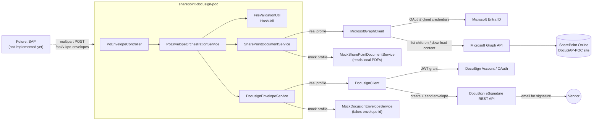

# sharepoint-docusign-poc

Technical proof-of-concept: given a dummy Purchase Order request, retrieve its
supporting documents from SharePoint, combine them with the main PO PDF, and
create/send a DocuSign envelope to the vendor for signature.

> **This is a POC only.** There is no SAP integration yet - SAP will later
> call the REST API built here. See [Future SAP Integration Contract](#future-sap-integration-contract).

## 1. Purpose

This service demonstrates, end-to-end and locally runnable, the flow SAP will
eventually trigger for vendor signature on Purchase Orders:

1. Receive a PO number, revision, vendor name/email and the main PO PDF.
2. Compute the SharePoint folder for that PO/revision (`/{poNumber}/REV-{revision}`).
3. Retrieve all eligible PDF documents from that folder via Microsoft Graph.
4. Assemble a DocuSign envelope: main PO document first, then the SharePoint
   documents sorted alphabetically.
5. Send the envelope to the vendor for signature (or create it as a draft).
6. Return the envelope id, status, included document names and any warnings.

A **mock mode** (Spring profile `mock`) lets you exercise the entire flow
without any Microsoft or DocuSign credentials, using local sample PDFs and a
fake DocuSign response.

## 2. Architecture



## 3. Project structure

```
sharepoint-docusign-poc/
├── pom.xml
├── .env.example
├── .gitignore
├── Dockerfile
├── docker-compose.yml
├── README.md
├── scripts/
│   └── GenerateSamplePdfs.java        # generates the dummy PDFs below
├── sample-files/
│   └── Purchase-Order-4500000105.pdf  # main PO sample (contains /vendor-signature/)
├── postman/
│   └── sharepoint-docusign-poc.postman_collection.json
└── src
    ├── main
    │   ├── java/com/example/sharepointdocusign/
    │   │   ├── SharepointDocusignPocApplication.java
    │   │   ├── config/       (ApplicationProperties, MicrosoftGraphProperties,
    │   │   │                   DocusignProperties, WebClientConfig, CorrelationIdFilter)
    │   │   ├── controller/   (PoEnvelopeController)
    │   │   ├── dto/          (CreatePoEnvelopeMetadata, CreatePoEnvelopeResponse, ErrorResponse)
    │   │   ├── exception/    (PoEnvelopeException + subclasses, GlobalExceptionHandler)
    │   │   ├── model/        (SharePointDocument, EnvelopeDocument, EnvelopeCreationResult)
    │   │   ├── service/      (SharePointDocumentService + Mock/real impl,
    │   │   │                   DocusignEnvelopeService + Mock/real impl,
    │   │   │                   MicrosoftTokenService, DocusignAuthService,
    │   │   │                   PoEnvelopeOrchestrationService)
    │   │   ├── client/       (MicrosoftGraphClient, DocusignClient)
    │   │   └── util/         (FileValidationUtil, HashUtil, SharePointPaths, LogMaskingUtil)
    │   └── resources/
    │       ├── application.yml, application-local.yml, application-mock.yml
    │       └── mock-sharepoint/4500000105/REV-02/*.pdf
    └── test/
        ├── java/com/example/sharepointdocusign/...   (unit + MockMvc + WireMock tests)
        └── resources/
            ├── application-test.yml
            └── mock-sharepoint/... (extra fixtures for edge-case tests)
```

## 4. Prerequisites

- Java 21 (JDK)
- Maven 3.9+ (or use your IDE's bundled Maven)
- VS Code (with the Java/Spring extensions) or IntelliJ IDEA
- For **real mode** only: a Microsoft Entra app registration with Graph
  `Sites.Read.All`/`Files.Read.All` application permissions, and a DocuSign
  developer/demo account with JWT consent granted.

## 5. How to run in mock mode

Mock mode needs **no external credentials**. It uses `MockSharePointDocumentService`
(reads PDFs from `src/main/resources/mock-sharepoint/...`) and
`MockDocusignEnvelopeService` (never calls DocuSign, returns a fake envelope id).

```bash
cd sharepoint-docusign-poc
mvn spring-boot:run -Dspring-boot.run.profiles=mock
```

Or, from a built jar:

```bash
mvn -DskipTests package
java -jar target/sharepoint-docusign-poc.jar --spring.profiles.active=mock
```

In IntelliJ/VS Code: set the run configuration's active profile to `mock`
(environment variable `SPRING_PROFILES_ACTIVE=mock`).

The dummy PDFs already exist in this repo. If you ever need to regenerate
them (see [section 8](#8-how-to-create-the-dummy-sharepoint-folders)):

```bash
java scripts/GenerateSamplePdfs.java
```

## 6. How to run in real mode

Three profiles are available:

| Profile | SharePoint | DocuSign | Credentials needed |
|---|---|---|---|
| `mock` | Mock (local PDFs) | Mock (fake envelope id) | None |
| `sharepoint-test` | **Real** (Microsoft Graph) | Mock (fake envelope id) | Microsoft/SharePoint only |
| `local` | **Real** (Microsoft Graph) | **Real** (DocuSign JWT) | Microsoft/SharePoint + DocuSign |

`sharepoint-test` is the recommended way to validate the real SharePoint
integration in isolation before you have (or want to risk using) real
DocuSign credentials - see the end of this section for how to confirm the
documents really came from SharePoint while the envelope id is still fake.

### Loading environment variables (Windows PowerShell)

Both real-mode profiles read secrets from environment variables. On Windows,
use the bundled loader script instead of the Linux/macOS
`export $(grep -v '^#' .env | xargs)` idiom (which does not work in
PowerShell):

```powershell
# Copy .env.example to .env and fill in real values first (see section 7).
.\scripts\load-env.ps1
```

This reads `.env` in the current directory and sets each variable at
**Process scope** only (visible to this shell and anything it launches
afterwards, such as `mvn`) - nothing is written to your persistent User or
Machine environment. It prints the names of the variables it loaded, never
their values. See `scripts/load-env.ps1` for the exact parsing rules (blank
lines and `#` comments ignored, split only on the first `=`, surrounding
quotes trimmed).

On macOS/Linux, the equivalent one-liner still works:

```bash
export $(grep -v '^#' .env | xargs)
```

### 6.1 Real SharePoint + mock DocuSign (`sharepoint-test` profile)

Requires only the `MICROSOFT_*` / `SHAREPOINT_*` variables from
[section 7](#7-required-environment-variables) - no `DOCUSIGN_*` variables
are read by this profile.

**Windows PowerShell:**

```powershell
.\scripts\load-env.ps1
mvn spring-boot:run "-Dspring-boot.run.profiles=sharepoint-test" "-Dspring-boot.run.arguments=--server.port=8081"
```

**macOS/Linux:**

```bash
export $(grep -v '^#' .env | xargs)
mvn spring-boot:run -Dspring-boot.run.profiles=sharepoint-test
```

The profile already defaults to port 8081 (see
`application-sharepoint-test.yml`) precisely so it can run side by side with
a `mock`-profile instance on 8080; the explicit `--server.port=8081` argument
above is redundant but harmless if you want to be explicit about it.

Send the same request as in mock mode (section 14) at
`http://localhost:8081/api/v1/po-envelopes`. The response's `envelopeId` will
still look like `mock-envelope-...`, but `documentsIncluded` now reflects
whatever PDFs actually exist in your real SharePoint `4500000105/REV-02`
folder - see [Verifying real SharePoint vs. mocked DocuSign](#verifying-real-sharepoint-vs-mocked-docusign)
at the end of this README for exactly how to confirm that.

### 6.2 Real SharePoint + real DocuSign (`local` profile)

Requires all variables in [section 7](#7-required-environment-variables),
including the `DOCUSIGN_*` ones.

**Windows PowerShell:**

```powershell
.\scripts\load-env.ps1
mvn spring-boot:run "-Dspring-boot.run.profiles=local"
```

**macOS/Linux:**

```bash
export $(grep -v '^#' .env | xargs)
mvn spring-boot:run -Dspring-boot.run.profiles=local
```

Send the same request as in mock mode (section 14). This time the service
will fetch real documents from SharePoint and create a real DocuSign
envelope (sent to the vendor email you provide - use your own test mailbox
while experimenting).

## 7. Required environment variables

| Variable | Purpose | Example |
|---|---|---|
| `MICROSOFT_TENANT_ID` | Entra tenant id | `11111111-2222-3333-4444-555555555555` |
| `MICROSOFT_CLIENT_ID` | Entra app (client) id | `66666666-7777-8888-9999-000000000000` |
| `MICROSOFT_CLIENT_SECRET` | Entra app client secret | `super-secret-value` |
| `SHAREPOINT_HOSTNAME` | SharePoint tenant hostname | `company.sharepoint.com` |
| `SHAREPOINT_SITE_PATH` | Site-relative path | `/sites/DocuSAP-POC` |
| `SHAREPOINT_DRIVE_ID` | Document library drive id | `b!AbCdEf...` |
| `DOCUSIGN_INTEGRATION_KEY` | DocuSign Integration Key (JWT client id) | `aaaaaaaa-bbbb-cccc-dddd-eeeeeeeeeeee` |
| `DOCUSIGN_USER_ID` | DocuSign impersonated user's GUID | `ffffffff-0000-1111-2222-333333333333` |
| `DOCUSIGN_ACCOUNT_ID` | DocuSign account id | `12345678-90ab-cdef-1234-567890abcdef` |
| `DOCUSIGN_PRIVATE_KEY_PATH` | Path to the RSA private key (PEM) used for the JWT grant | `/home/me/docusign_private_key.pem` |
| `DOCUSIGN_BASE_PATH` | DocuSign REST API base path | `https://demo.docusign.net/restapi` |
| `DOCUSIGN_OAUTH_BASE_PATH` | DocuSign OAuth host | `account-d.docusign.com` |
| `DOCUSIGN_SEND_ENVELOPE` | `true` = send, `false` = create as draft | `true` |
| `DOCUSIGN_CONNECT_HMAC_SECRET` *(required for the signed-document webhook)* | Shared secret configured in DocuSign Connect, used to verify the `X-DocuSign-Signature-1` header. Blank = the webhook rejects every request (fail closed) - it is not optional like `API_KEY`. | `a-long-random-shared-secret` |
| `SPRING_PROFILES_ACTIVE` | `mock` or `local` | `mock` |
| `MICROSOFT_GRAPH_CONNECT_TIMEOUT_MS` *(optional)* | TCP connect timeout for Graph/identity calls | `5000` |
| `MICROSOFT_GRAPH_READ_TIMEOUT_MS` *(optional)* | Time allowed between bytes once a response has started (matters most for large file downloads) | `10000` |
| `MICROSOFT_GRAPH_RESPONSE_TIMEOUT_MS` *(optional)* | Total time allowed for the full request/response | `15000` |

All of these are read purely from the environment - **no credentials are
hardcoded anywhere in this repository**. The three timeout variables are
optional; sensible defaults are already set in `application.yml`.

## 8. How to create the dummy SharePoint folders

Assumed real-world structure once Microsoft Graph is wired up (Phase 2):

```
PO-Documents/
└── 4500000105/
    └── REV-02/
        ├── Technical-Specification.pdf
        ├── Commercial-Conditions.pdf
        └── Safety-Requirements.pdf
```

For **mock mode**, this is simulated locally under
`src/main/resources/mock-sharepoint/4500000105/REV-02/`. To (re)generate the
three sample PDFs and the main PO sample, run from the project root:

```bash
java scripts/GenerateSamplePdfs.java
```

This creates:
- `sample-files/Purchase-Order-4500000105.pdf` (contains the literal text
  `Purchase Order 4500000105`, `Revision 02` and `/vendor-signature/`)
- `src/main/resources/mock-sharepoint/4500000105/REV-02/Technical-Specification.pdf`
- `src/main/resources/mock-sharepoint/4500000105/REV-02/Commercial-Conditions.pdf`
- `src/main/resources/mock-sharepoint/4500000105/REV-02/Safety-Requirements.pdf`

The script writes minimal, valid, non-copyrighted PDF 1.4 files by hand
(no external PDF library dependency).

To create the *real* SharePoint structure once you have a site: create the
`DocuSAP-POC` site, the `PO-Documents` document library, then the
`4500000105/REV-02` folder path, and upload the three sample PDFs there (or
your own PDFs) - either through the SharePoint UI or the Graph API.

## 9. How to register the Microsoft Entra application

1. In the [Azure Portal](https://portal.azure.com) go to **Microsoft Entra ID
   > App registrations > New registration**.
2. Give it a name (e.g. `sharepoint-docusign-poc`), select **Accounts in this
   organizational directory only** (single tenant is fine for a POC), leave
   Redirect URI empty, and click **Register**.
3. On the app's **Overview** page, copy:
   - **Application (client) ID** -> `MICROSOFT_CLIENT_ID`
   - **Directory (tenant) ID** -> `MICROSOFT_TENANT_ID`
4. Go to **Certificates & secrets > Client secrets > New client secret**, add
   a description and expiry, then immediately copy the secret **Value**
   (not the Secret ID) -> `MICROSOFT_CLIENT_SECRET`. It is only shown once.
5. Go to **API permissions > Add a permission > Microsoft Graph >
   Application permissions**, add `Sites.Read.All` and `Files.Read.All`
   (see [section 10](#10-required-graph-permissions)), then click
   **Grant admin consent for {tenant}** (requires a Global/Application
   Administrator - this step is mandatory, client-credentials calls fail
   with `AADSTS65001`/HTTP 401 until consent is granted).
6. Make sure the app can see the `DocuSAP-POC` site: with `Sites.Read.All` no
   further action is needed (it can read every site in the tenant); if you
   instead use `Sites.Selected`, grant that specific site's permission via
   `POST /sites/{site-id}/permissions` as described in
   [Microsoft's Sites.Selected documentation](https://learn.microsoft.com/en-us/graph/permissions-selected-overview).

### Finding your SHAREPOINT_DRIVE_ID

`SHAREPOINT_DRIVE_ID` identifies the `PO-Documents` document library's
underlying drive, not the site itself. With an access token (or interactively
via [Graph Explorer](https://developer.microsoft.com/en-us/graph/graph-explorer)):

```bash
# 1. Resolve the site id from hostname + site path
curl -H "Authorization: Bearer $TOKEN" \
  "https://graph.microsoft.com/v1.0/sites/company.sharepoint.com:/sites/DocuSAP-POC"
# -> note the "id" field, e.g. "company.sharepoint.com,11111111-...,22222222-..."

# 2. List that site's document libraries (drives) and find "PO-Documents"
curl -H "Authorization: Bearer $TOKEN" \
  "https://graph.microsoft.com/v1.0/sites/{site-id}/drives"
# -> the matching drive's "id" field is your SHAREPOINT_DRIVE_ID
```

## 10. Required Graph permissions

Application permissions (not delegated, since this app authenticates as
itself via client credentials):

| Permission | Type | Why |
|---|---|---|
| `Sites.Read.All` | Application | List folder children and read site/drive metadata |
| `Files.Read.All` | Application | Download file content |
| `Files.ReadWrite.All` | Application | Upload file content (`POST /api/v1/po-documents/{poNumber}[/{revision}]`) |

All three require **admin consent** - see step 5 above. For tighter production
scoping, `Sites.Selected` plus explicit site permission grants is recommended
over `Sites.Read.All`.

## 11. How to configure DocuSign JWT authentication

1. Create a DocuSign developer account at https://developers.docusign.com
   (or use your sandbox/demo account).
2. In the **Apps and Keys** admin page, create an Integration Key
   (`DOCUSIGN_INTEGRATION_KEY`).
3. Under that integration key, generate an **RSA keypair**. DocuSign shows
   you the private key once - save it to a file (e.g.
   `docusign_private_key.pem`) and point `DOCUSIGN_PRIVATE_KEY_PATH` at it.
   **Never commit this file** (it is already covered by `.gitignore`).
4. Note your **API Username** (a GUID, `DOCUSIGN_USER_ID`) and
   **API Account ID** (`DOCUSIGN_ACCOUNT_ID`) from the same admin page.
5. Set `DOCUSIGN_BASE_PATH=https://demo.docusign.net/restapi` and
   `DOCUSIGN_OAUTH_BASE_PATH=account-d.docusign.com` for the demo/sandbox
   environment.

## 12. How to give DocuSign user consent

JWT grants require one-time interactive consent from the impersonated user:

1. Build the consent URL:
   ```
   https://account-d.docusign.com/oauth/auth?response_type=code&scope=signature%20impersonation&client_id={DOCUSIGN_INTEGRATION_KEY}&redirect_uri={any_https_redirect_you_control}
   ```
2. Open it in a browser, log in as the user matching `DOCUSIGN_USER_ID`, and
   accept.
3. After that one-time consent, the application can silently obtain access
   tokens via the JWT grant (handled by `DocusignAuthService`, with the token
   cached and refreshed automatically before expiry).

## 13. How to place the anchor text in the dummy PO

DocuSign anchor tabs locate a signature field by searching the document text
for a string. The main PO sample PDF
(`sample-files/Purchase-Order-4500000105.pdf`) contains the literal text
`/vendor-signature/` on the page. The envelope's SignHere tab is configured
with:

```json
{
  "anchorString": "/vendor-signature/",
  "anchorUnits": "pixels",
  "anchorXOffset": "0",
  "anchorYOffset": "-10"
}
```

so the visible signature box appears immediately next to that marker. If you
supply your own PO PDF, make sure it contains that exact text somewhere on
the document (any font/size, as long as it is extractable text - not an
image of the text).

## 14. Postman / curl request example

### curl (bash / macOS / Linux)

```bash
curl -X POST http://localhost:8080/api/v1/po-envelopes \
  -H "Content-Type: multipart/form-data" \
  -F 'metadata={
    "poNumber":"4500000105",
    "revision":"02",
    "vendorName":"Dummy Vendor SRL",
    "vendorEmail":"test@example.com"
  };type=application/json' \
  -F 'purchaseOrderDocument=@sample-files/Purchase-Order-4500000105.pdf;type=application/pdf'
```

### Windows PowerShell

```powershell
$metadata = @{
    poNumber    = "4500000105"
    revision    = "02"
    vendorName  = "Dummy Vendor SRL"
    vendorEmail = "test@example.com"
} | ConvertTo-Json -Compress

$form = @{
    metadata               = $metadata
    purchaseOrderDocument  = Get-Item "sample-files/Purchase-Order-4500000105.pdf"
}

Invoke-RestMethod -Uri "http://localhost:8080/api/v1/po-envelopes" -Method Post -Form $form
```

> Note: `Invoke-RestMethod -Form` sends the `metadata` value as plain text; if
> your PowerShell version does not let you set its part content-type to
> `application/json`, that's fine - the server reads the raw JSON body
> regardless of the declared content type of that part.

### Postman

Import [`postman/sharepoint-docusign-poc.postman_collection.json`](postman/sharepoint-docusign-poc.postman_collection.json),
open the **Create PO Envelope** request, and in the **Body > form-data** tab:
- `metadata` - type "Text", paste the JSON, and manually set its Content-Type
  header override to `application/json` (Postman lets you do this per-field
  via the "..." menu on the field).
- `purchaseOrderDocument` - type "File", select `sample-files/Purchase-Order-4500000105.pdf`.

## 15. Successful response example

```json
{
  "success": true,
  "poNumber": "4500000105",
  "revision": "02",
  "envelopeId": "mock-envelope-3f2c9b1a-...",
  "status": "sent",
  "documentsIncluded": [
    "Purchase-Order-4500000105.pdf",
    "Commercial-Conditions.pdf",
    "Safety-Requirements.pdf",
    "Technical-Specification.pdf"
  ],
  "warnings": [],
  "correlationId": "40489675-85ba-4fb7-a10b-bab28dc960d6"
}
```

## 16. Error response examples

Folder not found:

```json
{
  "success": false,
  "poNumber": "4500000105",
  "revision": "02",
  "errorCode": "SHAREPOINT_FOLDER_NOT_FOUND",
  "message": "No SharePoint folder was found for PO 4500000105 and revision 02.",
  "correlationId": "8790609c-0d91-4410-81f8-f624593f515c"
}
```

Invalid main document:

```json
{
  "success": false,
  "poNumber": "4500000105",
  "revision": "02",
  "errorCode": "INVALID_PDF",
  "message": "Purchase-Order.txt must be a PDF file (unexpected content type: text/plain).",
  "correlationId": "..."
}
```

Full list of `errorCode` values: `INVALID_REQUEST`, `INVALID_PDF`,
`UNSUPPORTED_FILE_TYPE`, `SHAREPOINT_AUTHENTICATION_FAILED`,
`SHAREPOINT_FOLDER_NOT_FOUND`, `SHAREPOINT_FOLDER_EMPTY`,
`SHAREPOINT_ACCESS_DENIED`, `SHAREPOINT_DOWNLOAD_FAILED`,
`SHAREPOINT_UPLOAD_FAILED`, `TOO_MANY_DOCUMENTS`, `DOCUMENT_TOO_LARGE`,
`TOTAL_ENVELOPE_SIZE_EXCEEDED`, `DOCUSIGN_AUTHENTICATION_FAILED`,
`DOCUSIGN_ENVELOPE_CREATION_FAILED`, `DOCUSIGN_WEBHOOK_AUTHENTICATION_FAILED`,
`INTERNAL_ERROR`.

## 17. Test commands

```bash
# Full suite: unit tests, MockMvc controller tests (mock profile), WireMock
# tests for Microsoft Graph and DocuSign, and one full-context end-to-end
# test that exercises the real (non-mock) Graph + DocuSign wiring against
# WireMock. 63 tests, no external network calls, nothing to configure.
mvn test

# A single test class
mvn -Dtest=PoEnvelopeOrchestrationServiceTest test

# Package (also runs tests unless -DskipTests is passed)
mvn package

# Build and run via Docker (mock profile by default)
docker compose up --build
```

## 18. Security notes

- All secrets (Microsoft client secret, DocuSign private key path) come from
  environment variables - nothing is hardcoded, nothing is logged.
- The DocuSign RSA private key is read from disk at the path in
  `DOCUSIGN_PRIVATE_KEY_PATH` and is never embedded in source or config files.
- PO number and revision are validated against `^[A-Za-z0-9_-]+$` and
  additionally checked for `..`, `/`, `\` and percent-encoded traversal
  sequences before being used to build a SharePoint path
  (`SharePointPaths` / `FileValidationUtil`).
- Uploaded and downloaded PDFs are validated both by declared content type
  and by their `%PDF` magic bytes - never by file extension alone.
- Uploaded file names are sanitized (directory components stripped,
  traversal sequences rejected) before being used anywhere.
- Raw Microsoft Graph / DocuSign error bodies are never forwarded to API
  consumers - `GlobalExceptionHandler` maps every failure to a stable,
  documented `errorCode`.
- Every request gets a correlation id (`X-Correlation-Id` header, also
  echoed in the JSON response and in every log line via MDC).
- Vendor email addresses are masked in INFO-level logs (e.g. `t**t@example.com`).
  Document *content*, access tokens and secrets are never logged - only
  filename, size and SHA-256.

## 19. Limitations of the POC

- No persistence/database - every request is processed statelessly.
- No retry/backoff policy for transient Graph/DocuSign failures.
- No authentication/authorization on the REST API itself (it is meant to sit
  behind SAP or an API gateway that will add that later).
- Only one signer (the vendor) and a single SignHere tab are supported.
- `Sites.Read.All` / `Files.Read.All` / `Files.ReadWrite.All` are broad
  application permissions; production use should scope down to `Sites.Selected`.
- The DocuSign Connect webhook (see below) processes each notification fully
  synchronously in the request thread - no async/queue infrastructure exists
  here, matching this codebase's style everywhere else. A duplicate Connect
  delivery re-uploads the signed document, landing as a renamed copy
  (`...-1.pdf`) rather than overwriting - no data loss, just folder clutter
  over time.

## 19a. Auto-saving the signed document (DocuSign Connect webhook)

Closes the loop on Path A: once an envelope this app created is fully
signed, DocuSign Connect notifies `POST /webhooks/docusign/envelope-completed`
(deliberately outside `/api/**`, since DocuSign can't send `X-Api-Key`). The
notification is authenticated via HMAC-SHA256 (`X-DocuSign-Signature-1`,
`DOCUSIGN_CONNECT_HMAC_SECRET`) - **fail closed**, unlike `API_KEY`'s blank-
means-open default. Nothing about the webhook payload's shape or content is
trusted beyond the envelope id: this app calls back into DocuSign's own API
(reusing the same JWT-grant credentials) to fetch the envelope's authoritative
status and the `SAP_PO_NUMBER`/`SAP_PO_REVISION` custom fields already
stamped on every envelope (see [section 13](#13-how-to-place-the-anchor-text-in-the-dummy-po)),
then downloads the combined signed document and stores it as
`Signed-PO-{poNumber}-REV-{revision}.pdf` in the same SharePoint folder the
source documents came from - reusing the exact SharePoint-write path built
for the [documents-only upload endpoint](#storing-a-document-sap--sharepoint-no-docusign-involved).

Only active in real mode (same `!mock & !sharepoint-test` profile guard as
the rest of the DocuSign integration) - no real envelope, no real webhook.

**DocuSign Connect setup** (admin console → Connect → Add Configuration → Custom):
- URL to Publish: `https://<this-app-host>/webhooks/docusign/envelope-completed`
- Trigger Events: Envelope Events → **Completed** only
- Message format: **JSON**
- Include Documents / Certificate of Completion / custom fields in payload: leave **unchecked** (this app never trusts the payload beyond the envelope id, so a smaller payload is strictly better)
- Enable **HMAC**, generate one secret, set it as `DOCUSIGN_CONNECT_HMAC_SECRET` here

## 20. Future SAP Integration Contract

SAP does not call this service yet, but when it does, the contract is:

**SAP sends:**
- PO number
- PO revision
- Vendor name
- Vendor email
- Main PO PDF (binary)

**This service returns:**
- `envelopeId` - the DocuSign envelope identifier
- `status` - `sent` or `created` (draft)
- `documentsIncluded` - list of file names actually placed in the envelope
- `errorCode` / `message` - populated only on failure
- `correlationId` - for cross-system tracing/log correlation

**Preferred transport - multipart/form-data** (as implemented today): a JSON
`metadata` part plus a binary `purchaseOrderDocument` part. This is preferred
because it transfers the PDF as raw bytes with no encoding overhead and lets
SAP stream the attachment directly.

**Possible alternative - JSON with Base64-encoded PDF**, for SAP integration
tooling that cannot easily produce multipart requests:

```json
{
  "poNumber": "4500000105",
  "revision": "02",
  "vendorName": "Dummy Vendor SRL",
  "vendorEmail": "test@example.com",
  "purchaseOrderDocument": {
    "fileName": "Purchase-Order-4500000105.pdf",
    "contentType": "application/pdf",
    "contentBase64": "JVBERi0xLjQK..."
  }
}
```

This increases payload size by ~33% (Base64 overhead) and requires the
server to decode before validation, but may be simpler for some SAP outbound
adapters (e.g. SAP PI/PO REST adapters that prefer JSON). If SAP requires
this mode, a second endpoint or a content-type-based branch on the same
endpoint could be added without changing the response contract.

### Documents-only endpoint (no DocuSign involved)

Real-world feedback from the SAP/Tecnimont side clarified that SAP already
has its own direct connection to DocuSign - what's actually missing is just
the ability to pull documents out of SharePoint (e.g. to attach them to the
PO's own attachment list in SAP, via Generic Object Services). For that use
case, a separate, simpler endpoint is available that returns documents
without touching DocuSign at all:

```
GET /api/v1/po-documents/{poNumber}/{revision}
Header: X-Api-Key: ...
```

```json
{
  "success": true,
  "poNumber": "4500000105",
  "revision": "02",
  "documents": [
    {
      "fileName": "Commercial-Conditions.pdf",
      "contentType": "application/pdf",
      "size": 789,
      "sha256": "b7ae6c29ff58d6bdcf72ebfdfbede802a585ae5bf9598bf1ed856bf7f4a91963",
      "contentBase64": "JVBERi0xLjQK..."
    }
  ]
}
```

This reuses the same folder-path computation and SHA-256 verification as the
envelope endpoint, but **eligibility filtering is broader here**: this
endpoint returns every file type this app can also store (PDF, Word, Excel,
images - see the upload section below), not just PDFs. Envelope creation
(`POST /api/v1/po-envelopes`) still only bundles PDFs into a DocuSign
envelope - it needs real PDFs for the anchor-tag signing flow, and changing
that would be new, untested territory for how DocuSign handles non-PDF
attachments in this app's signing setup, so it's deliberately left as-is. A
Word/Excel/image document sitting in a PO folder will show up in a `GET`
here, but never in a signature envelope. Whichever HTTP client SAP uses for
outbound calls (e.g. `cl_http_client`) can call this the same way it would
call any other external REST API.

#### Flat folder layout (no revision subfolder)

Some POs only have a single folder named after the PO number, with the
documents directly inside it - no `REV-xx` subfolder at all. Both layouts are
supported side by side; the nested `REV-xx` layout keeps working exactly as
before. For a flat folder, just omit the revision path segment:

```
GET /api/v1/po-documents/{poNumber}
Header: X-Api-Key: ...
```

```json
{
  "success": true,
  "poNumber": "4500000233",
  "documents": [
    {
      "fileName": "4500000233_Commercial-Conditions.pdf",
      "contentType": "application/pdf",
      "size": 789,
      "sha256": "b7ae6c29ff58d6bdcf72ebfdfbede802a585ae5bf9598bf1ed856bf7f4a91963",
      "contentBase64": "JVBERi0xLjQK..."
    }
  ]
}
```

Note `revision` is simply absent from the response for this layout (it's
never included on the request path, and the JSON omits null fields). File
names are returned exactly as stored in SharePoint, including any PO-number
prefix already baked into the filename - no stripping or renaming is done.

#### Storing a document (SAP → SharePoint, no DocuSign involved)

The reverse direction: SAP pushes one document into the same SharePoint
folder through this app, rather than talking to Microsoft Graph directly.

```
POST /api/v1/po-documents/{poNumber}/{revision}
Header: X-Api-Key: ...
Body: multipart/form-data, field name "document" = the file
```

```json
{
  "success": true,
  "poNumber": "4500000105",
  "revision": "02",
  "fileName": "Commercial-Conditions.pdf",
  "size": 789,
  "sha256": "b7ae6c29ff58d6bdcf72ebfdfbede802a585ae5bf9598bf1ed856bf7f4a91963",
  "renamed": false
}
```

The flat-folder layout works the same way, just without the revision segment:

```
POST /api/v1/po-documents/{poNumber}
Header: X-Api-Key: ...
Body: multipart/form-data, field name "document" = the file
```

**One file per call** - a caller with several files to store calls this once
per file. **The target folder is created automatically** if it doesn't exist
yet (e.g. the very first document for a brand-new PO), so no manual
SharePoint setup is required beforehand. **Name collisions are handled by
SharePoint itself**: if a file with the same name already exists in that
folder, Microsoft Graph auto-renames the new upload (e.g. `Doc.pdf` →
`Doc 1.pdf`) rather than overwriting it - `fileName` in the response reflects
whichever name was actually used, and `renamed` is `true` when that happened.

**Supported file types**: PDF, Word (`.doc`/`.docx`), Excel (`.xls`/`.xlsx`),
and images (`.jpg`/`.jpeg`/`.png`) - deliberately not "any file type", to
keep arbitrary/unsafe files from being pushed into SharePoint through this
endpoint. PDF and image uploads are additionally checked against their magic
bytes (not just the declared content type or file extension); `.doc`/`.docx`/
`.xls`/`.xlsx` are checked by extension and declared content type only, since
the legacy binary Office format and the ZIP-based OOXML format each share
magic bytes across several unrelated file types. An unsupported extension is
rejected with `errorCode: UNSUPPORTED_FILE_TYPE`; a file whose *content*
doesn't match what its extension claims (e.g. a `.pdf` that isn't really a
PDF) is rejected with `errorCode: INVALID_PDF` for that specific case, or
`UNSUPPORTED_FILE_TYPE` for a `.jpg`/`.png` that isn't really an image.

In mock mode, uploads are simulated - logged and hashed, but not actually
persisted anywhere (mock-mode fixtures are read from the classpath, which
isn't writable at runtime), the same way `MockDocusignEnvelopeService` fakes
an envelope id without contacting DocuSign. `renamed` is always `false` in
mock responses since there's nothing real to collide with; the auto-rename
behavior can only be observed against real SharePoint (`sharepoint-test` or
`local` profile).

This endpoint requires the `Files.ReadWrite.All` Microsoft Graph application
permission (in addition to the `Files.Read.All`/`Sites.Read.All` already
listed in [section 10](#10-required-graph-permissions)), with admin consent
granted the same way.

---

## Implementation status

Fully implemented, all three modes:

- **Mock-mode end-to-end flow** - REST API, validation, `MockSharePointDocumentService`,
  `MockDocusignEnvelopeService`, orchestration, error handling.
- **Real Microsoft Graph integration** - client-credentials OAuth
  (`MicrosoftTokenService`), folder listing with `@odata.nextLink` pagination
  and content download with redirect-following (`MicrosoftGraphClient`),
  eligibility filtering and validation (`SharePointDocumentServiceImpl`), with
  explicit connect/read/response timeouts.
- **`sharepoint-test` profile** - real SharePoint retrieval paired with mock
  DocuSign, so the Graph integration can be validated without any DocuSign
  credentials. See [section 6.1](#61-real-sharepoint--mock-docusign-sharepoint-test-profile).
- **Real DocuSign integration** - JWT-grant authentication with cached/refreshed
  tokens (`DocusignAuthService`), envelope creation with an anchor-based
  SignHere tab and SAP custom fields (`DocusignClient` / `DocusignEnvelopeServiceImpl`).
- **Signed-document webhook** - DocuSign Connect notification handling with
  mandatory HMAC-SHA256 verification (`HmacSignatureVerifier`), authoritative
  status/custom-field re-fetch and combined-document download
  (`DocusignClient`), automatic SharePoint storage
  (`DocusignEnvelopeCompletionService`), profile-gated the same as the rest
  of the real DocuSign integration. See [section 19a](#19a-auto-saving-the-signed-document-docusign-connect-webhook).
- **Tests** - 157 tests: unit tests, MockMvc controller tests, WireMock tests
  for Microsoft Graph and DocuSign, Spring-context wiring tests (one per
  profile, including the webhook's own) proving each profile activates the
  right combination of real/mock beans, and two full end-to-end tests
  proving the real (non-mock) wiring works together - one for envelope
  creation, one for the signed-document webhook. Covers both the nested
  `REV-xx` and flat SharePoint folder layouts, both directions (read and
  write) of the documents-only endpoint - including that GET returns every
  supported file type while envelope creation stays PDF-only - and every
  supported upload file
  type (PDF, Word, Excel, images).
- **Postman collection, Dockerfile, docker-compose.yml** for easy local use.

## Verifying real SharePoint vs. mocked DocuSign

When running the `sharepoint-test` profile, here is how to confirm the
documents genuinely came from real SharePoint even though the envelope id is
still fake:

1. **Change something in the real SharePoint folder and see it reflected.**
   The bundled mock folder only ever contains `Technical-Specification.pdf`,
   `Commercial-Conditions.pdf` and `Safety-Requirements.pdf` for PO
   `4500000105`/`REV-02`. Add, rename, or remove a PDF in the *real*
   `4500000105/REV-02` SharePoint folder - if `documentsIncluded` in the
   response changes to match, the documents came from a live Graph call, not
   the local mock resources.
2. **Read the application logs.** Real retrieval logs come from
   `SharePointDocumentServiceImpl` / `MicrosoftGraphClient`, e.g.:
   ```
   Fetching SharePoint documents from folder path '4500000105/REV-02'
   Retrieved SharePoint document name=Technical-Specification.pdf size=48213 sha256=...
   ```
   Mock retrieval instead logs lines prefixed `[MOCK]` from
   `MockSharePointDocumentService`. Under `sharepoint-test` you should only
   ever see the former.
3. **Confirm DocuSign really is mocked.** The response's `envelopeId` always
   starts with `mock-envelope-` followed by a random UUID, and the log line
   comes from `MockDocusignEnvelopeService`, prefixed `[MOCK] Simulated
   DocuSign envelope...`. No `DocusignAuthService` or `DocusignClient` log
   lines will ever appear - those beans aren't even created in this profile
   (proven by `SharepointTestProfileWiringTest`).
4. **Cross-check the SHA-256 checksum.** Every retrieved document's SHA-256
   is logged. In PowerShell, compute the same file's checksum locally with
   `Get-FileHash -Algorithm SHA256 yourfile.pdf` and compare it to the logged
   `sha256=...` value - a match proves the exact bytes came from that file.
5. **Break it on purpose.** Temporarily rename the real SharePoint folder (or
   point `SHAREPOINT_DRIVE_ID` at a different, empty library) and resend the
   request - you should get a real `SHAREPOINT_FOLDER_NOT_FOUND` (HTTP 404)
   from Microsoft Graph, something the mock profile could never produce for
   a real folder path since it only ever reads bundled local resources.
